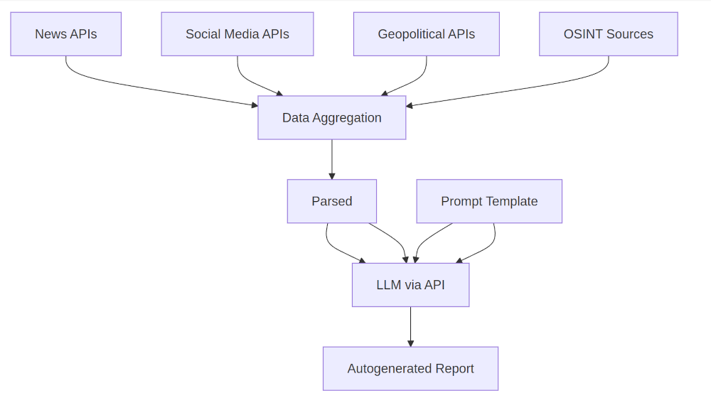

# Israel Situation Report (SITREP) Generation Prompts

Prompts to generate situational reports (SITREPs) for those looking for precise summaries of geopolitical and military developments in Israel and the MIddle East as a way of avoiding the cluttered news cycle filled with speculation (etc).

## Suggested Use-Cases

### API -> LLM -> Email Automation (Zapier, Pipedream, Make, etc)

1: Use a news or news aggregation API to gather news at fixed intervals.

2: Parse JSON responses.

3: Prompt an LLM with this prompt and the news using the format:

Here's a summary of recent news in Israel:

{API-outputs}

Based on that information please generate a report following this specification exactly:

{Prompt}

4: Connect LLM output to email in automation builder.

### APIs And Sources That May Be Useful As Data Sources

### News APIs

- [News API](https://newsapi.org/)
- [Currents API](https://currentsapi.services/)
- [NewsData.io](https://newsdata.io/)
- [NewsAPI.ai](https://www.newsapi.ai/)
- [Event Registry](https://eventregistry.org/)

### Geopolitical, OSINT-focused APIs

- GDELT
- ACLED

### Prompt an LLM with web browsing capability

Less reliable but suitable for ad-hoc use: simply prompt an LLM with real time browsing capabilities.

## Use Case Statement

## Author

Daniel Rosehill  
(public at danielrosehill dot com)

## Licensing

This repository is licensed under CC-BY-4.0 (Attribution 4.0 International) 
[License](https://creativecommons.org/licenses/by/4.0/)

### Summary of the License
The Creative Commons Attribution 4.0 International (CC BY 4.0) license allows others to:
- **Share**: Copy and redistribute the material in any medium or format.
- **Adapt**: Remix, transform, and build upon the material for any purpose, even commercially.

The licensor cannot revoke these freedoms as long as you follow the license terms.

#### License Terms
- **Attribution**: You must give appropriate credit, provide a link to the license, and indicate if changes were made. You may do so in any reasonable manner, but not in any way that suggests the licensor endorses you or your use.
- **No additional restrictions**: You may not apply legal terms or technological measures that legally restrict others from doing anything the license permits.

For the full legal code, please visit the [Creative Commons website](https://creativecommons.org/licenses/by/4.0/legalcode).